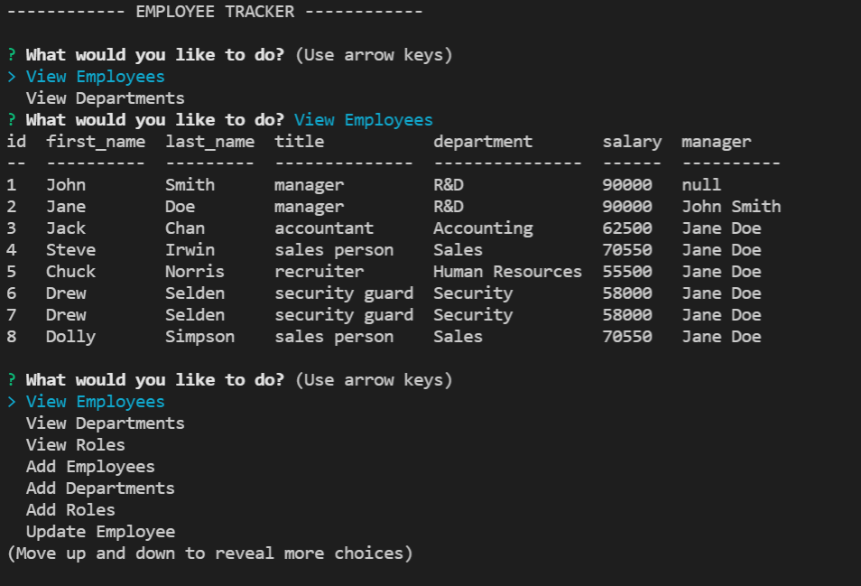

# Employee-Tracker
  
  ## Description
  --This app was made using JavaScript, MySQL, and NPM. The SQL database tracks employees, their roles, and the department they work in. You will be able to interact with the database with the inquirer package and be able to view, add, and update employees, roles, and departments.
  ## Table of Contents
  - [Installation](#installation)
  - [Usage](#usage)
  - [Credits](#credits)
  - [License](#license)
  ## Installation
  --Clone the repo and npm install the required packages.
  ## Usage
  --Type node index in the terminal to start. You can view/add/update employees/roles/departments. Use the arrow keys to move up and down and enter to select the option you want. Below is a demo video on how to use the app.

  
  
  [Video here!](https://www.youtube.com/watch?v=n48Hl4OHu5o)
  ## License
  --https://opensource.org/licenses/MIT
   
  --This application is covered under the MIT license.
  ## How to Contribute
  --If you would like to contribute on this app please feel free to contact me through the information below
  ## Tests
  --I included a seed.sql file so you can import into your own system and mess with the data if you'd like. There were no tests ran for this application.
  ## Questions
  --My GitHub account is https://github.com/selden-CBC2021

  --If you have any questions please email me at seldend1@gmail.com
  